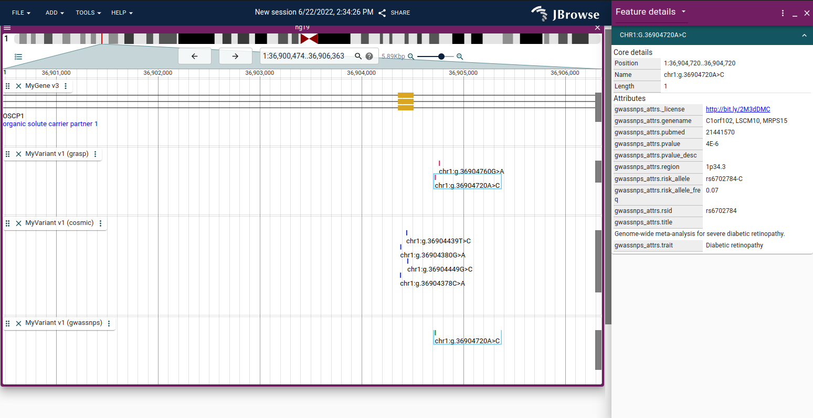

# `jbrowse-plugin-biothings`

> Adapts to APIs like mygene.info to get super rich gene annotations


#### Demo

https://s3.amazonaws.com/jbrowse.org/code/jb2/master/index.html?config=https%3A%2F%2Funpkg.com%2Fjbrowse-plugin-biothings%2Fdist%2Fconfig.json&session=share-AFbXiVTg5n&password=9hshE

#### Using in JBrowse 2

Add to the "plugins" of your JBrowse Web config:

```json
{
  "plugins": [
    {
      "name": "Biothings",
      "url": "https://unpkg.com/jbrowse-plugin-biothings/dist/jbrowse-plugin-biothings.umd.production.min.js"
    }
  ]
}
```

You can download that JS file and re-host it if you want to avoid a CDN


## Modifying the codebase or using in @jbrowse/react-linear-genome-view

See [DEVELOPERS.md](DEVELOPERS.md)


## Screenshot


